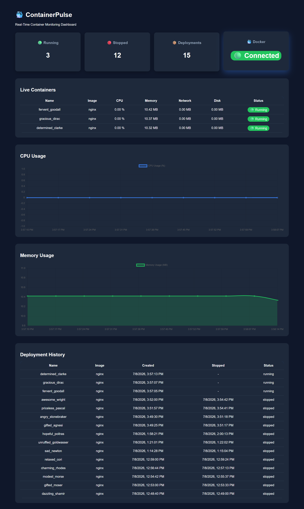
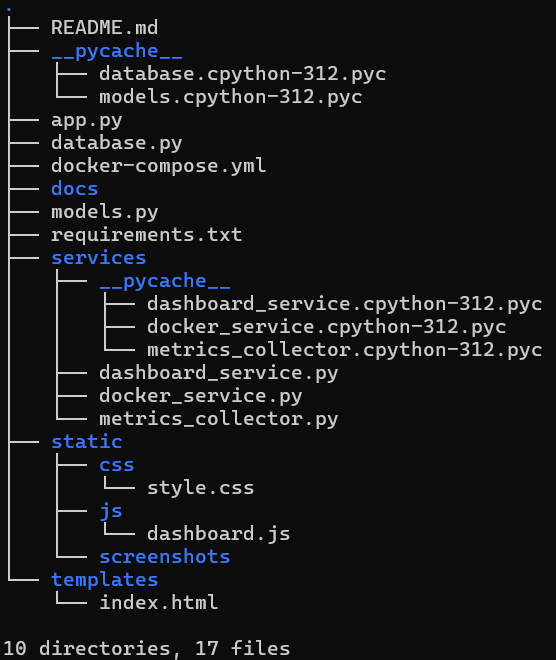
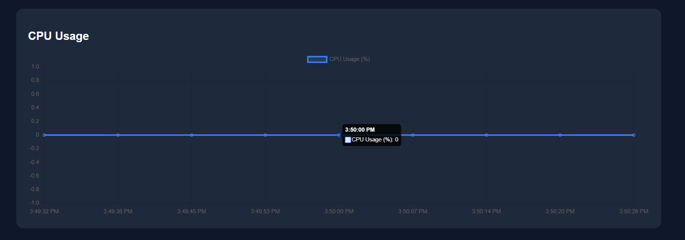
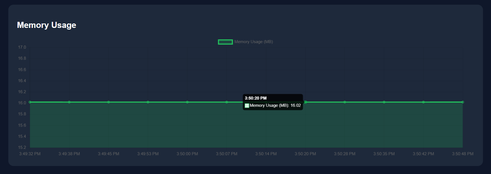
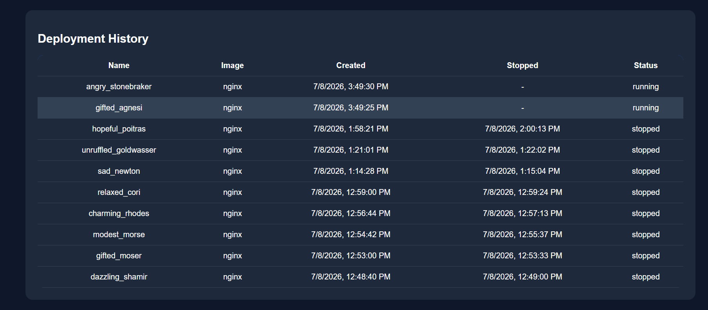
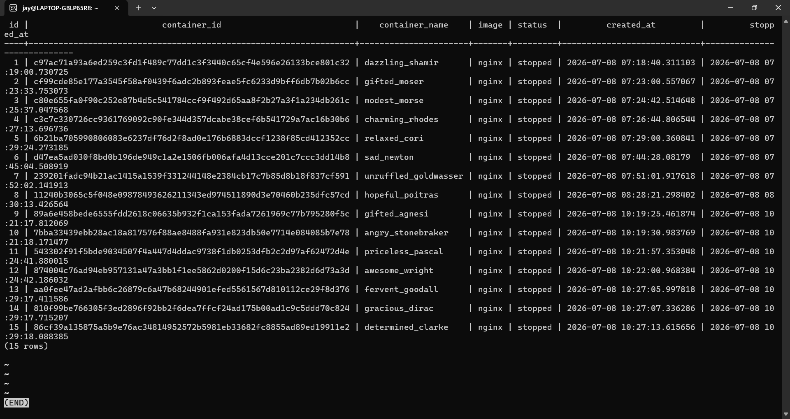
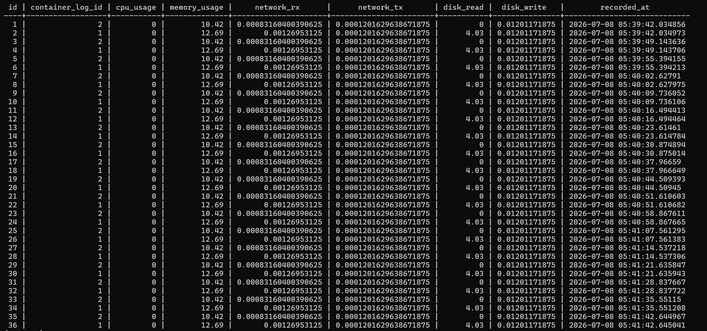

# 🐳 ContainerPulse

> A real-time Docker container monitoring dashboard built using Flask, PostgreSQL and Docker.

ContainerPulse is a lightweight monitoring system that tracks Docker containers running on a host machine. It collects container metrics such as CPU usage, memory usage, network activity and disk I/O, stores them in PostgreSQL, and visualizes the data through a real-time web dashboard.

---

## 📸 Dashboard Preview



---

# ✨ Features

- 🚀 Deploy Docker containers
- 📊 Real-time container monitoring
- 💾 Persistent PostgreSQL storage
- 📈 Historical CPU and Memory metrics
- 🌐 Network usage monitoring
- 💿 Disk I/O monitoring
- 📜 Deployment history
- 🔄 Automatic metric collection every 5 seconds
- 🐳 Docker Engine connectivity check
- REST APIs for monitoring data

---

# 🛠 Tech Stack

| Category | Technology |
|-----------|------------|
| Backend | Flask |
| Database | PostgreSQL |
| ORM | SQLAlchemy |
| Container Runtime | Docker |
| Monitoring | Docker CLI |
| Frontend | HTML, CSS, JavaScript |
| Charts | Chart.js |
| Operating System | Linux (WSL) |

---

# 📁 Project Structure



# ⚙️ How It Works

1. Flask exposes REST APIs for the dashboard.
2. Docker commands are executed using Python's `subprocess` module.
3. Every 5 seconds, a background metrics collector fetches live statistics from Docker.
4. Metrics are stored in PostgreSQL.
5. The frontend polls the APIs and updates the dashboard in real time.

---
# 📊 Dashboard

## Overview

Shows

- Running Containers
- Stopped Containers
- Total Deployments
- Docker Connection Status


---

## Live Container Monitoring

Displays live resource utilization of all running containers.

Metrics include

- CPU Usage
- Memory Usage
- Network Usage
- Disk I/O
- Container Status


---
## CPU Usage

Real-time CPU utilization collected every 5 seconds.



---
## Memory Usage

Real-time Memory utilization.



---
## Deployment History

Displays every deployment stored in PostgreSQL.

- Container Name
- Image
- Creation Time
- Stop Time
- Status



---
# 🗄 Data Model 

The application uses two tables.

## container_logs

Stores deployment information.

| Column |
|---------|
| container_id |
| container_name |
| image |
| status |
| created_at |
| stopped_at |



---

## container_metrics

Stores historical metrics.

| Column |
|---------|
| container_log_id |
| cpu_usage |
| memory_usage |
| network_rx |
| network_tx |
| disk_read |
| disk_write |
| recorded_at |



---
# 🌐 REST API

| Method | Endpoint | Description |
|----------|-----------|-------------|
| GET | `/dashboard` | Dashboard summary |
| GET | `/containers/live` | Running containers |
| GET | `/history` | Deployment history |
| GET | `/metrics/<container_id>` | Historical metrics |
| POST | `/deploy` | Deploy new container |
| POST | `/stop` | Stop all monitored containers |

---
# 🚀 Installation

Clone the repository

```bash
git clone https://github.com/yourusername/container-monitor.git

cd container-monitor
```

Create virtual environment

```bash
python -m venv venv
```

Activate

Linux

```bash
source venv/bin/activate
```

Windows

```bash
venv\Scripts\activate
```

Install dependencies

```bash
pip install -r requirements.txt
```

Start PostgreSQL

```bash
docker compose up -d
```

Run the application

```bash
python app.py
```

Open

```
http://localhost:5000
```

---
# 📚 What I Learned

During this project I gained practical experience with

- Flask REST APIs
- Docker CLI integration
- PostgreSQL
- SQLAlchemy ORM
- Background Threads
- System Monitoring
- Chart.js
- Linux Development
- Project Structuring
- Git & GitHub

---
# 🚧 Future Improvements

- Container restart endpoint
- Authentication
- User login
- Prometheus integration
- Grafana dashboards
- Kubernetes support
- Email alerts
- Multi-host monitoring
- Container filtering
- Search functionality

---
# 📄 License

MIT License